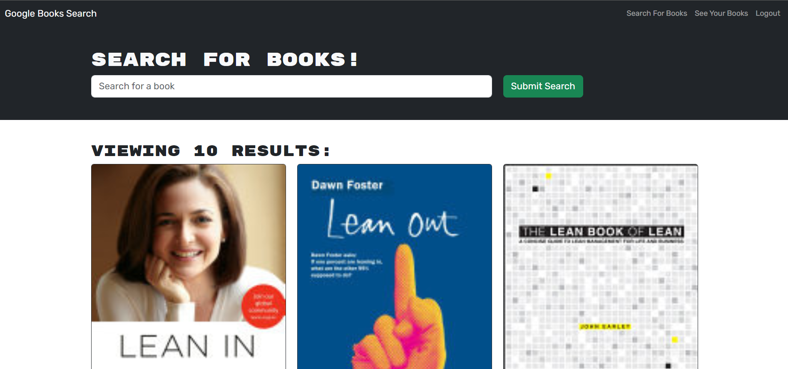

# MERN-bookSearchEngine

## Description

This is a Book search engine based on Google Books API. By using this app, you can search for new books to read and keep a list of books to purchase. The app was built using the MERN stack with a [React](https://www.npmjs.com/package/react) front end, [MongoDB](https://www.mongodb.com/docs/manual/tutorial/install-mongodb-on-windows/) database, Node.js/Express.js server, and [GraphQL](https://www.npmjs.com/package/graphql) API built with [ApolloServer](https://www.npmjs.com/package/@apollo/server).

## Table of Contents

- [Usage](#usage)
- [Technologies](#technologies)
- [Installation](#installation)
- [License](#license)
- [Questions](#questions)

## Usage

This application is deployed at: https://shrouded-fjord-19250-07ae1cd52725.herokuapp.com/

- GIVEN a book search engine
- WHEN you load the search engine
- THEN you are presented with a menu with the options Search for Books and Login/Signup and an input field to search for books and a submit button
- WHEN you click on the Search for Books menu option
- THEN you are presented with an input field to search for books and a submit button
- WHEN you are not logged in and enter a search term in the input field and click the submit button
- THEN you are presented with several search results, each featuring a book’s title, author, description, image, and a link to that book on the Google Books site
- WHEN you click on the Login/Signup menu option
- THEN a modal appears on the screen with a toggle between the option to log in or sign up
- WHEN the toggle is set to Signup
- THEN you are presented with three inputs for a username, an email address, and a password, and a signup button
- WHEN the toggle is set to Login
- THEN you are presented with two inputs for an email address and a password and login button
- WHEN you enter a valid email address and create a password and click on the signup button
- THEN your user account is created and you are logged in to the site
- WHEN you enter my account’s email address and password and click on the login button
- THEN the modal closes and you are logged in to the site
- WHEN you are logged in to the site
- THEN the menu options change to Search for Books, an option to see your saved books, and Logout
- WHEN you are logged in and enter a search term in the input field and click the submit button
- THEN you are presented with several search results, each featuring a book’s title, author, description, image, and a link to that book on the Google Books site and a button to save a book to your account
- WHEN you click on the Save button on a book
- THEN that book’s information is saved to your account
- WHEN you click on the option to see your saved books
- THEN you are presented with all of the books you have saved to your account, each featuring the book’s title, author, description, image, and a link to that book on the Google Books site and a button to remove a book from your account
- WHEN you click on the Remove button on a book
- THEN that book is deleted from your saved books list
- WHEN you click on the Logout button
- THEN you are logged out of the site and presented with a menu with the options Search for Books and Login/Signup and an input field to search for books and a submit button

## Technologies

- [React](https://www.npmjs.com/package/react)
- [Express.js](https://www.npmjs.com/package/express)
- [MongoDB](https://www.mongodb.com/docs/manual/tutorial/install-mongodb-on-windows/)
- [Mongoose](https://www.npmjs.com/package/mongoose)
- [bootstrap](https://www.npmjs.com/package/bootstrap)
- [GraphQL](https://www.npmjs.com/package/graphql)
- [ApolloServer](https://www.npmjs.com/package/@apollo/server)

## Installation

N/A

## License

N/A

## Questions

If you have additional questions, feel free to reach me through github or email.

Github: https://github.com/xybai0103

Email: xueyin0103@gmail.com
